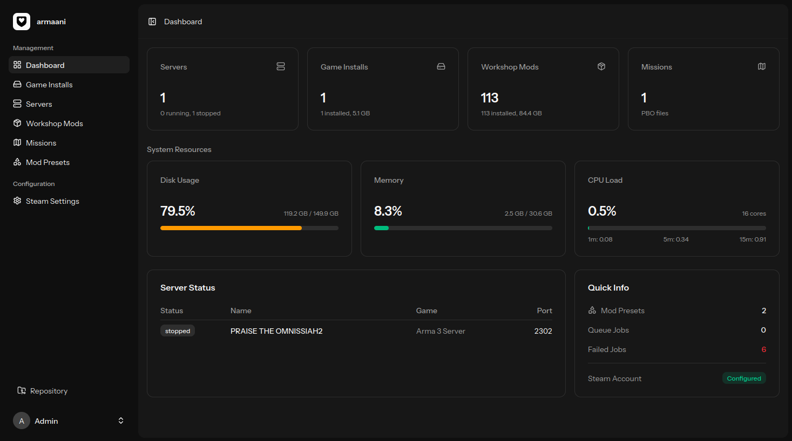
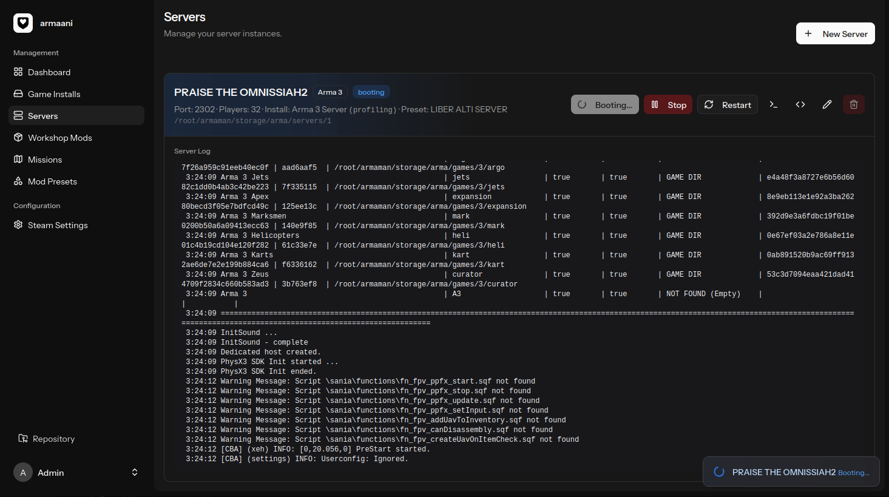

# Armaani

Armaani _(Finnish for *"my dear"*)_ is a web-based game server manager for Arma 3, Arma Reforger, and (soon) DayZ. Install, configure, and manage dedicated server instances from a single UI.

Built with Laravel 12, Inertia v2, React 19, Tailwind CSS v4, and with a bunch of help from Claude.

## Inspired by

[fugasjunior/arma-server-manager](https://github.com/fugasjunior/arma-server-manager)

## Screenshots





## Features

- Install and update game servers via SteamCMD
- Start, stop, and restart server instances with real-time log streaming
- Download and manage Steam Workshop mods
- Organize mods into presets and assign them to servers
- Import Arma 3 Launcher preset files
- Per-game server settings (difficulty, network, etc.)
- Dynamic headless client management (Arma 3)
- Profile backup and restore
- Real-time status updates via WebSockets

## Requirements

- PHP 8.4
- Node.js
- SQLite
- SteamCMD

## Setup

```bash
composer install
npm install
cp .env.example .env
php artisan key:generate
php artisan migrate
npm run build
```

## Development

```bash
composer run dev
```

## Testing

```bash
php artisan test
```

## License

AGPLv3
